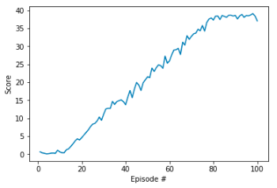

#  Project Report

## Implementation and Learning Algorithm  
Deep Deterministic Policy Gradients (DDPG) algorithm is used in this project as it is highly suitable for solving the continous control problems.  
The neural network contains two hidden layers of size 400 and 300 respectively for both critic and actor networks. ReLU activation function is used for the hidden layers and tanh function is used for the final output layer.  

Following hyperparameters are used for learning:  
~~~
BUFFER_SIZE = int(1e6)  # replay buffer size
BATCH_SIZE = 1024        # minibatch size
GAMMA = 0.99            # discount factor
TAU = 1e-3              # for soft update of target parameters
LR_ACTOR = 1e-3         # learning rate of the actor 
LR_CRITIC = 1e-3        # learning rate of the critic
~~~

##  Plot of Rewards
  
The Average score of 30 was achieved at the 70th episode. Afterwards, it remained stable and above the mark till the end of execution at 100th episode. 

##  Ideas for Future Work  
- Hyper parameters and different network architures can be explored further to improve the agent's learning speed.
- Trust Region Policy Optimization (TRPO), Truncated Natural Policy Gradient (TNPG) and Proximal Policy Optimization (PPO) can be investigated and implemented for improving the performance.
